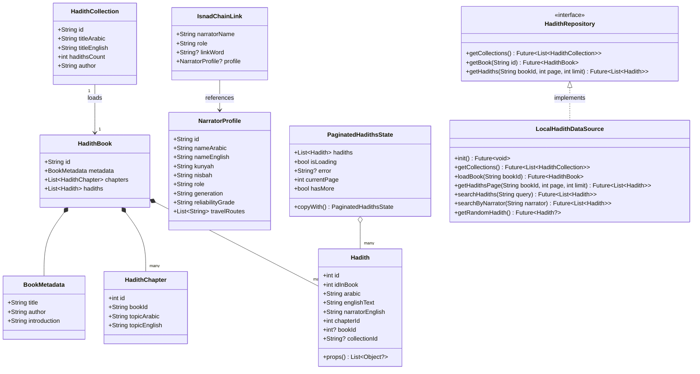
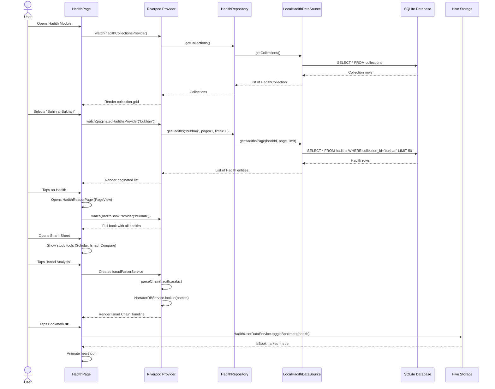
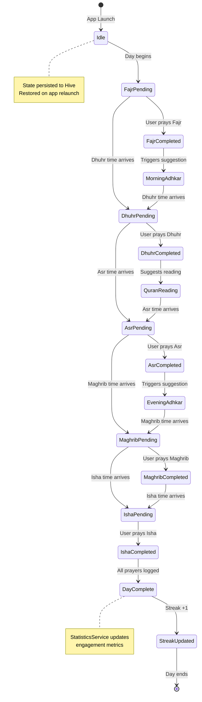
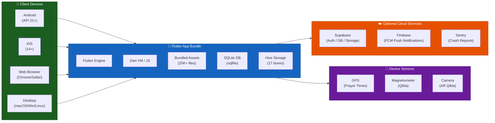

<p align="center">
  
  
  
  
  
  
</p>

<h1 align="center">🌙 نور — Noor</h1>
<h3 align="center">A Comprehensive Islamic Companion App</h3>

<p align="center">
  <em>Digital worship environment for Quran, Hadith, Prayer Times, Adhkar, Tafsir & more.</em><br/>
  <em>Offline-first • Privacy-respecting • Scholarly-grade data • Multi-platform</em>
</p>

---

## Overview

**Noor** (نور — "Light") is a feature-rich, production-grade Islamic companion app built with Flutter. It provides a unified, spiritually intuitive experience across Quran reading & recitation, Hadith study with Isnad analysis, GPS-based prayer times with Adhan scheduling, Qibla direction, Adhkar routines, Tafsir from classic scholars, spaced-repetition memorization, and detailed user analytics — all powered by an **offline-first architecture** with 25,000+ bundled assets requiring zero internet connectivity for core features.

---

## Table of Contents

- [Features](#features)
- [Architecture](#architecture)
- [Modélisation](#modélisation)
- [Tech Stack](#tech-stack)
- [Project Structure](#project-structure)
- [Getting Started](#getting-started)
- [Configuration](#configuration)
- [Core Services](#core-services)
- [Data Pipeline](#data-pipeline)
- [Testing](#testing)
- [Deployment](#deployment)
- [Contributing](#contributing)

---

## Features

### 📖 Quran Module
- **Full Mushaf** — Complete 604-page Quran with page-accurate rendering
- **Surah Reader** — Verse-by-verse reading with tajweed color-coding
- **Audio Recitation** — Background audio with `just_audio` + `audio_service` integration, supporting multiple reciters
- **Khatmah Planner** — Algorithmic Quran completion scheduler with daily goal clamping and progress tracking
- **Bookmarks & Notes** — Persistent verse-level annotations via Hive
- **Share as Image** — Export beautifully styled ayah cards for social sharing

### 📚 Hadith Module
- **9 Major Collections** — Bukhari, Muslim, Abu Dawud, Tirmidhi, Nasa'i, Ibn Majah, Muwatta, Musnad Ahmad, Darimi
- **Nawawi's 40 & Beyond** — Curated collections with scholarly explanations
- **Advanced Browser** — Paginated, chapter-based navigation with SQLite-backed instant queries
- **Scholar Mode** — Deep analysis view with Isnad chain statistics, narrator biographies, and connectivity indicators
- **Isnad Chain Visualizer** — Interactive timeline showing narrator-by-narrator chain of transmission
- **Isnad DAG Graph** — Custom-painted directed acyclic graph with zoom/pan, color-coded narrator types, and arrowhead edges
- **Narrator Database** — Normalized, scholarly-grade database with *Ilm al-Rijal* metadata (Tadlis, Ikhtilat, reliability grades)
- **Narration Comparison** — Side-by-side comparison of parallel narrations across collections
- **Topic Tree** — Dynamically generated thematic categorization of hadiths
- **Spaced Repetition** — FSRS-based memorization system with customizable intervals
- **Quizzes** — Auto-generated hadith quizzes with real distractor options
- **Learning Statistics** — Comprehensive analytics dashboard with streak tracking

### 🕌 Prayer Module
- **GPS Prayer Times** — Accurate calculation via the `adhan` library with seasonal offset corrections
- **Adhan Scheduler** — Platform-native notification scheduling for all five prayers + Tahajjud
- **Prayer Tracker** — Qada tracking and daily prayer completion logging
- **Mosque Mode** — Congregation-aware mode with silent UI transitions
- **Location Trust Engine** — Multi-source location validation with confidence scoring

### 🧭 Qibla Direction
- **Compass Integration** — Real-time magnetometer-based Qibla direction using `flutter_compass`
- **AR Qibla** — Camera-overlay augmented reality mode via `camera` package
- **Spherical Geodesy** — Precise great-circle bearing calculations

### 📿 Adhkar & Tools
- **Morning & Evening Adhkar** — Complete collections with repetition counters
- **Post-Prayer Adhkar** — Context-aware suggestions based on prayer time
- **Digital Tasbih** — Tap counter with haptic feedback and session history
- **Smart Suggestions** — Time-of-day aware Dhikr recommendations

### 📖 Tafsir
- **4 Classical Tafsir Sources** — Muyassar, Ibn Kathir, Sa'di, Tabari
- **25,000+ Verse Explanations** — Bundled locally for instant offline access
- **Verse-Linked** — Direct navigation from Quran reader to tafsir

### 🔍 Search
- **Full-Text Search** — Across Quran, Hadith, and Adhkar with normalized Arabic text matching
- **Fuzzy Matching** — Handles diacritics, Hamza variations, and partial matches
- **Multi-Target** — Search by text, narrator, companion, topic, or grade

### 📊 Analytics & Profile
- **Reading Streaks** — Daily engagement tracking with streak maintenance
- **Statistics Dashboard** — Charts via `fl_chart` showing memorization progress, reading habits, and quiz scores
- **Day State Machine** — Sophisticated FSM tracking daily worship state transitions
- **Home Screen Widgets** — Native Android/iOS widgets for prayer times and daily verse (`home_widget`)

---

## Architecture

Noor follows **Clean Architecture** with clear separation into three layers, enforced by directory structure:

```
┌─────────────────────────────────────────────────────────┐
│                    Presentation Layer                     │
│   Pages • Widgets • Providers (Riverpod StateNotifiers)  │
├─────────────────────────────────────────────────────────┤
│                      Domain Layer                        │
│          Entities • Repositories (Abstract)              │
├─────────────────────────────────────────────────────────┤
│                       Data Layer                         │
│   DataSources (SQLite/Hive/JSON) • Repository Impls      │
├─────────────────────────────────────────────────────────┤
│                     Core Services                        │
│  Engines • Algorithms • Theme • Router • Shared Utils    │
└─────────────────────────────────────────────────────────┘
```

### Key Architectural Decisions

| Decision | Rationale |
|---|---|
| **Offline-First** | All Quran, Hadith, Tafsir, and Adhkar data is bundled as assets. Zero network dependency for core features. |
| **SQLite + Hive Hybrid** | SQLite (`sqflite`) for structured relational data (hadiths, chapters). Hive for fast key-value user data (bookmarks, settings, streaks). |
| **Riverpod** | Compile-safe dependency injection with `StateNotifier` for complex state, `FutureProvider.family` for parameterized async data. |
| **GoRouter** | Declarative, deep-link-ready routing with `ShellRoute` for persistent bottom navigation. |
| **Feature-First Modules** | Each feature (Quran, Hadith, Prayer, etc.) is self-contained with its own domain/data/presentation layers. |
| **No User Tracking** | Sentry crash reporting with `sendDefaultPii: false`, `attachScreenshot: false`. No analytics SDKs. |

---

## Modélisation

### 1. Component Diagram — System Overview

```mermaid
graph TB
    subgraph Presentation["🖥️ Presentation Layer"]
        HP["HomePage"]
        QP["QuranPage"]
        HDP["HadithPage"]
        PP["PrayerPage"]
        AP["AdhkarPage"]
        QBP["QiblaPage"]
        SP["SearchPage"]
        PFP["ProfilePage"]
    end

    subgraph StateManagement["⚙️ State Management - Riverpod"]
        RP_Q["QuranProviders"]
        RP_H["HadithProviders"]
        RP_P["PrayerProviders"]
        RP_S["SearchProviders"]
    end

    subgraph Domain["📐 Domain Layer"]
        E_H["Hadith Entity"]
        E_Q["Quran Entity"]
        E_P["Prayer Entity"]
        R_H["HadithRepository"]
        R_Q["QuranRepository"]
    end

    subgraph Data["💾 Data Layer"]
        SQLite["SQLite DB\n(sqflite)"]
        Hive["Hive Boxes\n(17 stores)"]
        JSON["Bundled JSON\n(25K+ assets)"]
        Supabase["Supabase\n(Optional Cloud)"]
    end

    subgraph Services["🔧 Core Services"]
        PTE["PrayerTimeEngine"]
        QE["QiblaEngine"]
        ISP["IsnadParserService"]
        NDS["NarratorDBService"]
        HSE["HadithSearchEngine"]
        SNE["SmartNotificationEngine"]
        DSM["DayStateMachine"]
        QAE["QuranAudioEngine"]
        STS["StatisticsService"]
    end

    HP --> RP_Q & RP_H & RP_P
    QP --> RP_Q
    HDP --> RP_H
    PP --> RP_P
    SP --> RP_S

    RP_Q --> R_Q
    RP_H --> R_H
    RP_S --> HSE

    R_H --> SQLite & Hive
    R_Q --> JSON & Hive

    PTE --> Hive
    DSM --> Hive
    STS --> Hive
    ISP --> NDS
    NDS --> JSON

    SNE --> PTE
    QAE --> JSON

    style Presentation fill:#1a5e3a,stroke:#0d3320,color:#fff
    style StateManagement fill:#b8860b,stroke:#8b6508,color:#fff
    style Domain fill:#4a148c,stroke:#311b92,color:#fff
    style Data fill:#0d47a1,stroke:#0a3470,color:#fff
    style Services fill:#bf360c,stroke:#8c2809,color:#fff
```



### 2. Class Diagram — Hadith Domain Model



### 3. Entity-Relationship Diagram — Data Layer

```mermaid
erDiagram
    COLLECTIONS {
        string id PK
        string title_arabic
        string title_english
        string author_arabic
        int hadith_count
        string introduction
    }

    CHAPTERS {
        int id PK
        string collection_id FK
        string title_arabic
        string title_english
        int sort_order
    }

    HADITHS {
        int id PK
        int id_in_book
        string collection_id FK
        int chapter_id FK
        text arabic
        text english_text
        string english_narrator
    }

    NARRATORS {
        string id PK
        string name_arabic
        string name_english
        string kunyah
        string nisbah
        string role
        int generation_level
        string reliability_grade
        string verdict_source
    }

    NARRATOR_RELATIONSHIPS {
        string id PK
        string from_narrator_id FK
        string to_narrator_id FK
        string relationship_type
        string link_word
    }

    HIVE_BOOKMARKS {
        string key PK
        int hadith_id
        string collection_id
        text arabic
        int timestamp
    }

    HIVE_PROGRESS {
        string key PK
        string book_id
        int hadith_index
        int total_hadiths
        int timestamp
    }

    HIVE_STATISTICS {
        string key PK
        int streak_count
        int total_read
        int quiz_score
        string last_active
    }

    COLLECTIONS ||--o{ CHAPTERS : contains
    CHAPTERS ||--o{ HADITHS : contains
    COLLECTIONS ||--o{ HADITHS : belongs_to
    NARRATORS ||--o{ NARRATOR_RELATIONSHIPS : from
    NARRATORS ||--o{ NARRATOR_RELATIONSHIPS : to
    HADITHS ||--o{ HIVE_BOOKMARKS : bookmarked_as
```

### 4. Sequence Diagram — Hadith Reader Flow



### 5. State Diagram — Day State Machine



### 6. Deployment Diagram — Multi-Platform Architecture



---

## Tech Stack

### Core Framework
| Technology | Purpose |
|---|---|
| Flutter 3.x | Cross-platform UI framework |
| Dart ≥3.0 | Language with null safety |

### State & Navigation
| Package | Purpose |
|---|---|
| `flutter_riverpod` | Reactive state management |
| `go_router` | Declarative routing with deep links |
| `equatable` | Value equality for entities and states |

### Storage
| Package | Purpose |
|---|---|
| `sqflite` | SQLite database for hadith collections |
| `hive_flutter` | NoSQL key-value store for user data |
| `flutter_secure_storage` | Encrypted storage for sensitive data |

### Backend & Sync
| Package | Purpose |
|---|---|
| `supabase_flutter` | Cloud sync and remote data (optional) |
| `firebase_messaging` | Push notifications |
| `http` | REST API calls |

### Islamic Libraries
| Package | Purpose |
|---|---|
| `adhan` | Prayer time calculation engine |
| `hijri` | Hijri calendar conversion |

### Media & UI
| Package | Purpose |
|---|---|
| `just_audio` + `audio_service` | Quran recitation with background playback |
| `google_fonts` | Cairo & Amiri typography |
| `fl_chart` | Statistics charts |
| `flutter_svg` | Vector icon rendering |
| `flutter_animate` | Micro-animations |
| `pdf` + `printing` | PDF export |
| `share_plus` | Social sharing |

### Sensors & Location
| Package | Purpose |
|---|---|
| `geolocator` | GPS location for prayer times |
| `flutter_compass` | Magnetometer for Qibla |
| `sensors_plus` | Device sensor access |
| `camera` | AR Qibla mode |
| `geocoding` | Reverse geocoding for city names |

### Observability
| Package | Purpose |
|---|---|
| `sentry_flutter` | Crash reporting (privacy-first, no PII) |

---

## Project Structure

```
lib/
├── main.dart                          # App entry point, service initialization
├── core/
│   ├── algorithms/
│   │   └── fsrs_algorithm.dart        # Free Spaced Repetition Scheduler
│   ├── data/
│   │   ├── data_sources/
│   │   │   ├── hadith_database.dart   # SQLite schema & queries
│   │   │   └── local_hadith_data_source.dart
│   │   └── repositories/             # Repository implementations
│   ├── domain/
│   │   ├── entities/                  # Core business entities
│   │   └── repositories/             # Abstract repository contracts
│   ├── router/
│   │   └── app_router.dart           # GoRouter configuration (30+ routes)
│   ├── services/                     # 37 core services
│   │   ├── prayer_time_engine.dart   # GPS-based prayer calculation
│   │   ├── qibla_engine.dart         # Spherical geodesy for Qibla
│   │   ├── isnad_parser_service.dart  # Arabic Isnad chain extraction
│   │   ├── narrator_database_service.dart  # Ilm al-Rijal lookups
│   │   ├── hadith_search_engine.dart  # Full-text search with normalization
│   │   ├── smart_notification_engine.dart  # AI-driven notification scheduling
│   │   ├── day_state_machine.dart     # Daily worship state FSM
│   │   ├── quran_audio_engine.dart    # Background audio playback
│   │   ├── statistics_service.dart    # Engagement analytics
│   │   └── ...
│   ├── theme/
│   │   ├── design_system.dart        # NoorDesignSystem tokens
│   │   └── noor_theme.dart           # Material ThemeData (light/dark)
│   └── widgets/
│       └── main_shell.dart           # Bottom navigation shell
├── features/
│   ├── quran/                        # 16 files
│   │   └── presentation/pages/
│   │       ├── quran_page.dart       # Surah index
│   │       ├── quran_surah_page.dart # Verse reader
│   │       ├── quran_mushaf_page.dart # Full Mushaf view
│   │       └── khatmah_page.dart     # Completion planner
│   ├── hadith/                       # 25 files
│   │   ├── data/datasources/         # Data models & sources
│   │   ├── domain/entities/          # Hadith, HadithGrade, etc.
│   │   └── presentation/
│   │       ├── pages/                # 18 pages
│   │       │   ├── hadith_page.dart
│   │       │   ├── hadith_reader_page.dart
│   │       │   ├── scholar_mode_page.dart
│   │       │   ├── isnad_chain_page.dart
│   │       │   ├── isnad_graph_page.dart
│   │       │   ├── memorization_page.dart
│   │       │   ├── quiz_page.dart
│   │       │   └── ...
│   │       ├── providers/            # Riverpod providers
│   │       └── widgets/              # Reusable hadith widgets
│   ├── prayer/                       # Prayer times & tracking
│   ├── adhkar/                       # Adhkar collections
│   ├── qibla/                        # Qibla compass & AR
│   ├── tafsir/                       # 4-source tafsir browser
│   ├── audio/                        # Audio playback controls
│   ├── search/                       # Cross-module search
│   ├── home/                         # Dashboard with smart cards
│   ├── profile/                      # User profile & stats
│   ├── settings/                     # App configuration
│   ├── onboarding/                   # First-run experience
│   └── tools/                        # Tasbih, misc utilities
└── shared/                           # Cross-feature shared code

assets/                               # 25,000+ bundled files
├── quran/                            # Quran text (JSON)
├── hadith/                           # 627 files
│   ├── narrators.json                # Normalized narrator database
│   └── by_book/                      # 9 major collections + forties
├── tafsir/                           # 25,401 files
│   ├── muyassar/                     # Tafsir al-Muyassar
│   ├── ibn_kathir/                   # Tafsir Ibn Kathir
│   ├── saadi/                        # Tafsir al-Sa'di
│   └── tabari/                       # Tafsir al-Tabari
├── adhkar/                           # Morning/Evening/Post-prayer
└── fonts/                            # Custom Arabic typography
```

---

## Getting Started

### Prerequisites

| Requirement | Version |
|---|---|
| Flutter SDK | ≥ 3.0.0 |
| Dart SDK | ≥ 3.0.0 |
| Android SDK | API 21+ (Lollipop) |
| Xcode | 14+ (for iOS/macOS) |
| Chrome | Latest (for web) |

### Installation

```bash
# Clone the repository
git clone https://github.com/DukePan/noor-app.git
cd noor-app

# Install dependencies
flutter pub get

# Run on your preferred platform
flutter run                    # Default connected device
flutter run -d chrome          # Web
flutter run -d macos           # macOS desktop
flutter run -d windows         # Windows desktop
```

### First Run

On first launch, the app initializes the following services in order:

1. **Hive** — Opens 17 local storage boxes (bookmarks, progress, statistics, etc.)
2. **SQLite** — Creates or migrates the hadith database from bundled assets
3. **Statistics Service** — Initializes engagement tracking
4. **Day State Machine** — Sets up the daily worship FSM
5. **Offline Data Service** — Indexes bundled Quran, Hadith, and Tafsir assets
6. **Audio Service** — Configures background audio session
7. **Notifications** — Schedules prayer time Adhan notifications (mobile only)
8. **Home Widgets** — Updates native home screen widgets (mobile only)

---

## Configuration

### Environment Variables

| Variable | Required | Description |
|---|---|---|
| `SENTRY_DSN` | No | Sentry crash reporting DSN. If empty, Sentry is skipped entirely. |

Pass at build time:
```bash
flutter run --dart-define=SENTRY_DSN=https://your-dsn@sentry.io/project
```

### Supabase (Optional)

Cloud sync requires a Supabase project. Configure in `lib/core/services/supabase_service.dart`. Without Supabase, the app operates fully offline.

### Firebase (Optional)

Push notifications require Firebase. Add your `google-services.json` (Android) and `GoogleService-Info.plist` (iOS) to the respective platform directories.

---

## Core Services

### Prayer Time Engine (`prayer_time_engine.dart` — 42KB)
The largest service in the app. Implements multi-method prayer time calculation with:
- Seasonal offset corrections via `seasonal_offsets_engine.dart`
- Location trust scoring via `location_trust_engine.dart`
- Weekly schedule generation via `weekly_scheduler_service.dart`
- Health checks and self-diagnostics via `prayer_health_check.dart`

### Isnad Parser Service (`isnad_parser_service.dart`)
Regex-based Arabic NLP pipeline that extracts narrator chains from raw hadith text. Identifies narrators using transmission keywords (`حدثنا`, `أخبرنا`, `عن`, etc.) and classifies them as Prophet, Companion, Tabi'i, or later narrators.

### Narrator Database Service (`narrator_database_service.dart`)
Loads and indexes the normalized `narrators.json` database. Provides fuzzy lookup for narrator biographies, reliability grades, and *Ilm al-Rijal* metadata including Tadlis classifications and Ikhtilat documentation.

### Hadith Search Engine (`hadith_search_engine.dart`)
Full-text search with Arabic text normalization (diacritic removal, Hamza normalization, Ta Marbuta handling). Supports multi-target search (text, narrator, companion, topic, grade) with relevance scoring.

### Smart Notification Engine (`smart_notification_engine.dart`)
Context-aware notification system that adapts to user behavior patterns, prayer times, and time-of-day. Avoids notification fatigue through intelligent scheduling and deduplication.

### Day State Machine (`day_state_machine.dart`)
Finite state machine that tracks daily worship progress across multiple dimensions (prayers completed, Quran read, Adhkar recited). Persisted to Hive and restored across sessions.

---

## Data Pipeline

### Hadith Data Flow

```
┌──────────────────┐     ┌──────────────┐     ┌─────────────────┐
│ assets/hadith/   │────▶│ SQLite DB    │────▶│ LocalHadithDS   │
│ by_book/*.json   │     │ (sqflite)    │     │ (Data Source)    │
└──────────────────┘     └──────────────┘     └────────┬────────┘
                                                       │
                                                       ▼
┌──────────────────┐     ┌──────────────┐     ┌─────────────────┐
│ narrators.json   │────▶│ In-Memory    │────▶│ NarratorDB Svc  │
│ (Ilm al-Rijal)   │     │ Index        │     │ (Fuzzy Lookup)   │
└──────────────────┘     └──────────────┘     └─────────────────┘
                                                       │
                              ┌─────────────────────────┤
                              ▼                         ▼
                    ┌─────────────────┐     ┌─────────────────┐
                    │ IsnadParser     │     │ SearchEngine     │
                    │ (Chain Extract) │     │ (Full-Text)      │
                    └────────┬────────┘     └─────────────────┘
                             │
                    ┌────────┴────────┐
                    ▼                 ▼
          ┌─────────────┐   ┌─────────────────┐
          │ Chain Page   │   │ DAG Graph Page   │
          │ (Timeline)   │   │ (CustomPainter)  │
          └─────────────┘   └─────────────────┘
```

### Storage Strategy

| Data Type | Store | Rationale |
|---|---|---|
| Hadith collections | SQLite | Relational queries, pagination, FTS |
| User bookmarks | Hive (`hadith_bookmarks`) | Fast K/V access, small dataset |
| Reading progress | Hive (`hadith_progress`) | Single-key read/write |
| Settings | Hive (`settings`) | Simple preferences |
| Statistics | Hive (`app_statistics`) | Counters and aggregates |
| Quran text | Bundled JSON | Read-only reference data |
| Tafsir | Bundled JSON (25K files) | Read-only, per-verse files |
| Narrators | Bundled JSON → In-Memory | Fuzzy search requires full index |

---

## Testing

```bash
# Run unit & widget tests
flutter test

# Static analysis (should be 0 errors)
flutter analyze

# Build for production (web)
flutter build web --release

# Build for production (Android)
flutter build apk --release

# Build for production (iOS)
flutter build ios --release
```

---

## Deployment

### Android
```bash
flutter build appbundle --release
# Upload to Google Play Console
```

### iOS
```bash
flutter build ipa --release
# Upload via Xcode or Transporter
```

### Web
```bash
flutter build web --release --web-renderer html
# Deploy build/web/ to any static host (Firebase Hosting, Vercel, Netlify)
```

---

## Contributing

1. Fork the repository
2. Create a feature branch (`git checkout -b feature/amazing-feature`)
3. Follow the existing architecture patterns (Clean Architecture + Feature-First)
4. Ensure `flutter analyze` returns **0 errors**
5. Add tests for new services and business logic
6. Commit with conventional commits (`feat:`, `fix:`, `refactor:`)
7. Open a Pull Request

### Code Style
- Follow `flutter_lints` rules
- Use `GoogleFonts.cairo()` for UI text, `GoogleFonts.amiri()` for Quranic/Hadith text
- All user-facing strings should be in Arabic by default
- New services should be registered in `lib/core/services/services.dart`


