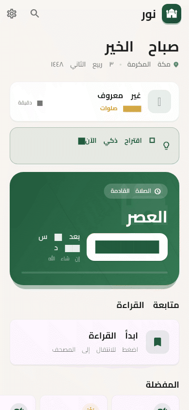

<p align="center">
  
</p>

<h1 align="center">نور · Noor</h1>

<p align="center">
  <em>A digital worship environment: Quran, hadith, prayer times, adhkar, tafsir.</em><br>
  <sub>Offline-first &middot; no account &middot; no ads &middot; no tracking &middot; Arabic and English</sub>
</p>

<p align="center">
  
  
  
  
  
</p>

<p align="center">
  
</p>

<p align="center">
  <sub><a href="README.ar.md">العربية</a></sub>
</p>

---

Noor (نور — "light") is an Islamic companion app for reading, listening, and
keeping a daily routine: the full Quran with tafsir, the nine hadith
collections with Isnad study tools, prayer times with adhan scheduling, qibla,
and adhkar with sources.

Everything a Muslim needs daily works with **no network at all** — the Quran,
hadith, tafsir, and adhkar are bundled with the app. There is no account to
create, nothing is advertised to you, and no personal data leaves the device
unless you explicitly turn on the (aggregate-only) usage counters.

## Numbers

Each figure below is verifiable in this repository, and most are enforced by CI
so they cannot quietly drift.

| | Value | Enforced by |
|---|---|---|
| Tests | 651, all green | `flutter test` |
| Line coverage | 30.70% (floor 30, raised as pages land) | `tools/coverage_summary.py` |
| Hadith collections | 9 major collections + Nawawi's 40 | `assets/db/hadith.db` (checksummed) |
| Tafsir sources | 4 — Muyassar, Ibn Kathir, Sa'di, Tabari | `assets/db/` (checksummed) |
| Mushaf | 604 pages, Uthmani text | checksum sidecar + integrity test |
| Prayer calculation methods | 19, plus per-region presets | `prayer_time_models.dart` |
| Bundle size | 221.8 MB (budget 230 MB) | `tools/check_assets_size.py` |
| Arabic/English string parity | 662 keys each | `tools/check_arb_parity.py` |
| Static analysis | 0 issues | `flutter analyze` |
| File-size ceiling | enforced, with 13 grandfathered files tracked and capped in the check's baseline | `tools/file_size_check.py` |

## What it does

**Quran** — the 604-page mushaf with Uthmani script, a khatmah planner that
turns "read the whole Quran" into a daily quota with progress tracking,
recitation with background playback, four classical tafsir sources linked to
the verse you are reading, per-verse notes and bookmarks, and ayah cards you can
export as images.

**Hadith** — the nine collections and the forty of Imam al-Nawawi, with
full-text search that normalises Arabic (diacritics, hamza forms, ta marbuta),
so «الرحمن» finds «ٱلرحمن». Scholar mode adds an Isnad chain view, narrator
lookup, narration comparison across collections, a topic tree, and a
spaced-repetition (FSRS) memorisation system with quizzes and statistics.

**Prayer & qibla** — 19 calculation methods with per-country presets, seasonal
offsets, adhan scheduling, qada tracking, a congregation-aware "mosque mode"
that quiets the UI, and a magnetometer qibla compass with great-circle bearing.

**Adhkar & tools** — morning, evening, post-prayer, sleep and waking adhkar
with repetition counters and source references, a digital tasbih, and
time-of-day aware suggestions.

**Getting there** — a day-state machine tracks where you are in the day's worship
(Fajr → adhkar → Dhuhr → …), surfaces the next thing at the right time, keeps
streaks and statistics, and shows prayer times on a home-screen widget.

**Languages & accessibility** — Arabic and English with CI-gated key parity and
correct RTL/LTR behaviour; the primary flows carry screen-reader labels and
tap-target sizes verified by Flutter's accessibility guidelines
(`docs/accessibility.md`).

## Privacy by construction

- **No account, no ads, no third-party analytics SDK.** The app ships its own
  opt-in counters, off by default: an allowlist of feature events
  (`app_open`, `surah_opened`, …), aggregate counts only — no identity, no
  timestamps, no content — and nothing leaves the device unless you configure an
  endpoint.
- **Crash reports are opt-in and PII-free**, only when a DSN is supplied at
  build time, with `sendDefaultPii: false`, `attachScreenshot: false` and
  tracing disabled.
- **Location stays on the device** — used to compute prayer times and the qibla,
  never sent anywhere.
- **Your notes are encrypted** on-device, and bookmarks, progress, and
  statistics live in local storage only.

## Content integrity

Religious content deserves the same rigour as the code:

- **Checksums for every content set** (Quran, hadith, adhkar, narrators) with
  sidecar `.sha256` files so any silent change is caught.
- **A scholarly review tracker** (`docs/scholarly-review.md`) mapping each
  content set to its freeze hash and review status. Review is release-blocking.
- **The narrator database does not fabricate.** Fields for *Ilm al-Rijal*
  verdicts exist in the schema but are populated only where a citation exists —
  an empty field is honest, an invented grade is not.
- **Guards against documentation drift**: a claim-guard test fails the build if
  a user-facing doc advertises a capability that is not in the code, and a
  mojibake guard fails on any corrupted Arabic text.

## Install

```bash
git clone https://github.com/0DukePan/noor-app.git
cd noor-app
flutter pub get
flutter run                 # connected Android/iOS device or emulator
```

Requires the Flutter stable channel (Dart ≥ 3.0). Core features need no
network; a first launch imports the bundled hadith database once.

> **Web is not supported.** The app depends on native plugins (SQLite, adhan
> scheduling, background audio, compass, geolocation) that have no web
> implementation.

Optional crash reporting, at build time only:

```bash
flutter run --dart-define=SENTRY_DSN=https://your-dsn@sentry.io/project
```

Or build release artifacts:

```bash
flutter build appbundle --release   # Google Play
flutter build ipa --release         # App Store
```

## Architecture

Clean Architecture in three layers, feature-first modules, Riverpod for state,
GoRouter for navigation, SQLite for relational content and Hive for user data:

```
┌─────────────────────────────────────────────────────────┐
│                    Presentation Layer                    │
│   Pages • Widgets • Providers (Riverpod)                 │
├─────────────────────────────────────────────────────────┤
│                      Domain Layer                        │
│          Entities • Repositories (abstract)              │
├─────────────────────────────────────────────────────────┤
│                       Data Layer                         │
│   DataSources (SQLite/Hive/bundled JSON) • Repo impls     │
├─────────────────────────────────────────────────────────┤
│                     Core Services                        │
│  Engines • Algorithms • Theme • Router • Shared utils     │
└─────────────────────────────────────────────────────────┘
```

The component, class, ER, sequence, state-machine and deployment diagrams live
in **[docs/ARCHITECTURE.md](docs/ARCHITECTURE.md)**.

## Quality gates

Every push runs the same gates locally and in CI (`.github/workflows/ci.yml`):

| Gate | What it protects |
|---|---|
| `flutter analyze` | 0 issues |
| `flutter test` | the whole suite green |
| `tools/coverage_summary.py` | app-wide coverage floor |
| `tools/file_size_check.py` | one file cannot quietly become a god-file |
| `tools/check_assets_size.py` | bundle stays inside the 230 MB budget |
| `tools/check_exclusions.py` | coverage exclusions stay small and justified |
| `tools/check_arb_parity.py` | Arabic and English never diverge |
| `flutter test integration_test` (emulator) | the real app boots: DB import, onboarding, all five tabs |

## Documentation

| Document | Contents |
|---|---|
| [docs/ARCHITECTURE.md](docs/ARCHITECTURE.md) | Layers, component/class/ER/sequence/state/deployment diagrams |
| [docs/accessibility.md](docs/accessibility.md) | What is labelled and verified, what is still manual |
| [docs/API_SOURCES.md](docs/API_SOURCES.md) | Where the content comes from, endpoint by endpoint |
| [docs/testing-guidelines.md](docs/testing-guidelines.md) | Hard-won notes on testing this codebase |
| [docs/performance.md](docs/performance.md) | Startup, size and jank measurements |
| [docs/coverage-inventory.md](docs/coverage-inventory.md) | Per-file coverage and risk inventory |
| [docs/coverage-exclusions.md](docs/coverage-exclusions.md) | Every line deliberately not covered, and why |
| [docs/scholarly-review.md](docs/scholarly-review.md) | Content review status and freeze hashes |
| [docs/qa-checklist.md](docs/qa-checklist.md) | The on-device pass before a release |
| [docs/store-checklist.md](docs/store-checklist.md) | Store submission requirements |
| [docs/media/README.md](docs/media/README.md) | How the demo GIF is generated or replaced |

## FAQ

**Why is the download 221 MB?**
The Quran, four tafsir sources, and the nine hadith collections ship inside the
app so that nothing needs a connection — including in airplane mode, on a
plane, or in a mosque basement. The size is CI-budgeted at 230 MB, and moving
the reference databases to on-demand packs is a deliberate post-1.0 decision
recorded in `docs/store-checklist.md`.

**Does it really work offline?**
Yes for all core content. The network is only ever used for optional fetches
(the bundled tafsir covers the 4 sources; recitation streams if you choose a
remote reciter).

**What do you collect about me?**
Nothing by default. Crash reporting and usage counters are both opt-in; the
counters are aggregate-only with no identity, timestamps or content, and are
never shared with a third party.

**Why are some narrator reliability fields empty?**
Because filling them requires a citation. The app would rather show a blank
field than an invented *Ilm al-Rijal* verdict — see
`docs/scholarly-review.md`.

**Is the source open?**
No. The repository is proprietary (see [LICENSE](LICENSE)); the published app is
free to use.

**How do I regenerate the demo GIF or get screenshots?**
`docs/media/README.md` has both the regeneration commands and the spec for
dropping in a real device recording.

## License

[Proprietary — all rights reserved.](LICENSE) The published application is free
to download and use.

<sub>العربية: [README.ar.md](README.ar.md)</sub>
