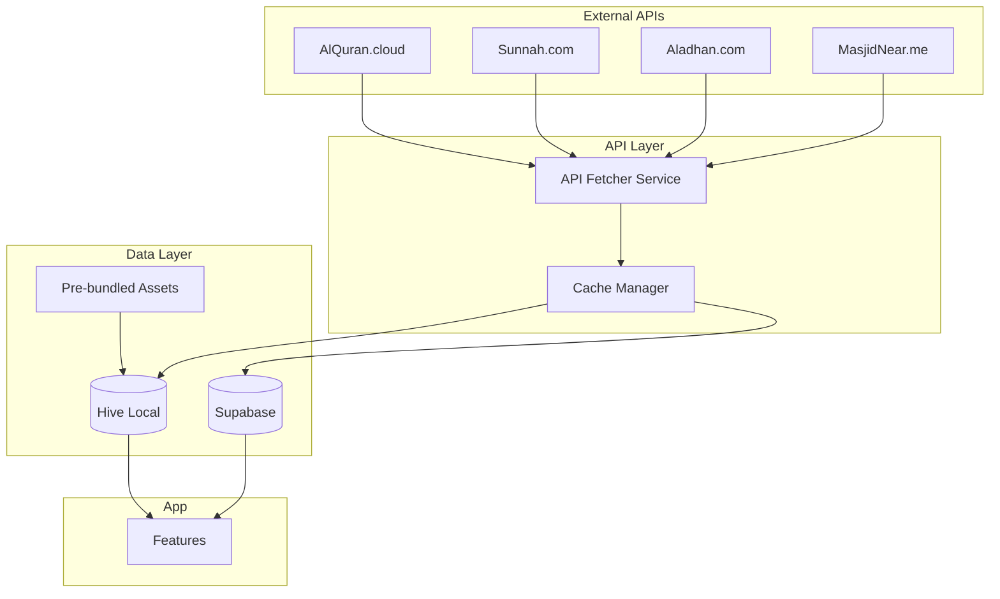

# مصادر البيانات الشرعية - Islamic Data Sources & APIs

## 📖 القرآن الكريم (Quran APIs)

### 1. Al Quran Cloud ⭐ Primary
| | |
|---|---|
| **URL** | `https://api.alquran.cloud/v1/` |
| **Docs** | [alquran.cloud/api](https://alquran.cloud/api) |
| **Features** | Ayah, Surah, Juz, 90+ editions, audio recitations |
| **Auth** | None required |
| **Rate Limit** | Generous (no strict limit) |

**Endpoints:**
```
GET /surah                    # All surahs
GET /surah/{number}           # Surah with verses
GET /surah/{number}/{edition} # Specific edition (Hafs/Warsh)
GET /ayah/{ref}/{edition}     # Single ayah
GET /edition                  # Available editions
GET /edition/type/tafsir      # Tafsir editions
```

### 2. fawazahmed0/quran-api ⭐ Backup
| | |
|---|---|
| **URL** | `https://cdn.jsdelivr.net/gh/fawazahmed0/quran-api@1/` |
| **GitHub** | [fawazahmed0/quran-api](https://github.com/fawazahmed0/quran-api) |
| **Features** | 400+ translations, 90+ languages, no rate limit |
| **Format** | Static JSON files (CDN) |

### 3. Tafsir API
| | |
|---|---|
| **URL** | `https://api.quran.com/api/v4/` |
| **Docs** | [api-docs.quran.com](https://api-docs.quran.com/) |
| **Features** | 25+ tafsirs, word-by-word, translations |

---

## 📚 السنة النبوية (Hadith APIs)

### 1. Sunnah.com API ⭐ Primary
| | |
|---|---|
| **URL** | `https://api.sunnah.com/v1/` |
| **Docs** | [sunnah.stoplight.io/docs/api](https://sunnah.stoplight.io/docs/api/) |
| **Collections** | Bukhari, Muslim, Abu Dawud, Tirmidhi, Ibn Majah, Nasai |
| **Auth** | API Key (request via GitHub issue) |

**Endpoints:**
```
GET /collections           # All collections
GET /collections/{name}    # Collection info
GET /hadiths?collection=   # Hadiths by collection
GET /hadiths/{urn}         # Single hadith
```

### 2. HadeethEnc.com API ⭐ Backup
| | |
|---|---|
| **URL** | `https://hadeethenc.com/api/v1/` |
| **Docs** | [hadeethenc.com/en/info/api](https://hadeethenc.com/en/info/api) |
| **Features** | Authentic hadiths with explanations, multi-language |
| **Auth** | None |

---

## 🕌 مواقيت الصلاة (Prayer Times APIs)

### 1. Aladhan API ⭐ Primary
| | |
|---|---|
| **URL** | `https://api.aladhan.com/v1/` |
| **Docs** | [aladhan.com/prayer-times-api](https://aladhan.com/prayer-times-api) |
| **Features** | 15+ calculation methods, calendar, Qibla |
| **Auth** | None required |

**Endpoints:**
```
GET /timings/{date}?latitude=&longitude=&method=  # Daily times
GET /calendar/{year}/{month}?latitude=&longitude= # Monthly calendar
GET /qibla/{latitude}/{longitude}                  # Qibla direction
GET /methods                                        # Calculation methods
```

**Methods:** MWL(3), ISNA(2), Egypt(5), Makkah(4), Karachi(1), Tehran(7)

### 2. adhan Package (Offline) ⭐ Local Calculation
| | |
|---|---|
| **Package** | `adhan: ^2.0.0` |
| **Docs** | [pub.dev/packages/adhan](https://pub.dev/packages/adhan) |
| **Features** | Offline calculation, same accuracy as API |

---

## 🧭 اتجاه القبلة (Qibla APIs)

### Aladhan Qibla
```
GET https://api.aladhan.com/v1/qibla/{latitude}/{longitude}
```
Response: `{ "data": { "latitude": 21.4225, "longitude": 39.8261, "direction": 152.89 }}`

**Local Calculation:** Use spherical bearing formula (implemented in `CompassService`).

---

## 🕋 المساجد (Mosque Finder APIs)

### 1. MasjidNear.me API
| | |
|---|---|
| **URL** | `https://masjidnear.me/api/v1/` |
| **Endpoint** | `GET /masjid?lat=&long=&radius=` |
| **Auth** | None |

### 2. OpenStreetMap (Overpass API)
```
[out:json];
node["amenity"="place_of_worship"]["religion"="muslim"](around:5000,lat,lon);
out;
```

---

## 📿 الأذكار (Adhkar Sources)

### GitHub JSON Sources ⭐ Pre-bundle
| Source | URL |
|--------|-----|
| **Hisn al-Muslim** | `github.com/rn0x/Adhkar-json` |
| **Morning/Evening** | `github.com/Seen-Arabic/Morning-And-Evening-Adhkar-DB` |
| **MuslimKit** | `github.com/ahegazy/muslimKit` |

---

## 🔄 Integration Stack Diagram



---

## 🛡️ Integration Strategies

### 1. Pre-bundle Essential Data
```yaml
assets/quran/quran_hafs.json    # 604 pages Uthmani text
assets/adhkar/hisn_muslim.json  # All adhkar
assets/hadith/arbaeen.json      # 40 Nawawi hadith
```

### 2. Lazy Fetch with Delta Updates
```dart
class ApiCacheManager {
  Future<void> syncIfNeeded(String resource) async {
    final lastSync = await _getLastSyncTime(resource);
    if (_isStale(lastSync)) {
      await _fetchAndCache(resource);
    }
  }
}
```

### 3. Failover Chain
```dart
Primary: AlQuran.cloud → Backup: fawazahmed0 → Fallback: Local Assets
```

### 4. API Abstraction Layer
```dart
abstract class QuranDataSource {
  Future<Surah> getSurah(int number);
}

class AlQuranCloudSource implements QuranDataSource { ... }
class FawazQuranSource implements QuranDataSource { ... }
class LocalQuranSource implements QuranDataSource { ... }
```

---

## ⚠️ Challenges & Solutions

| Challenge | Solution |
|-----------|----------|
| API downtime | Failover chain + local fallback |
| Rate limiting | Aggressive caching, delta updates |
| Large data size | Lazy loading, pagination |
| Network offline | Pre-bundled essentials |
| Data freshness | Background sync, TTL caching |
| API key security | Store in Flutter secure storage |
