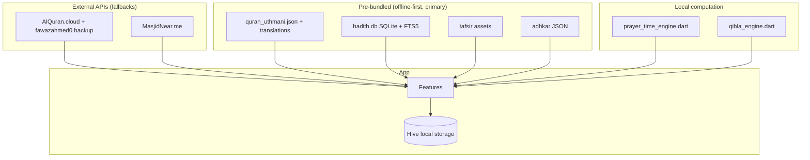

# مصادر البيانات الشرعية - Islamic Data Sources & APIs

> **Accuracy note (2026-08-19):** Noor is **offline-first**. The primary data
> ships inside the app (Quran JSON, hadith SQLite `hadith.db`, tafsir DB,
> adhkar JSON), and prayer times / Qibla direction are computed locally by
> `prayer_time_engine.dart` / `qibla_engine.dart` — no network required.
> The endpoints below are the capabilities of `ApiFetcherService`
> (`lib/core/services/api_fetcher_service.dart`), used as network fallbacks
> (e.g. the mosque finder in the quran data source). Supabase is **not**
> part of the stack — earlier versions of this doc referenced it; it has
> been removed.

## 📖 القرآن الكريم (Quran APIs — implemented in `ApiFetcherService`)

### 1. Al Quran Cloud ⭐ Primary
| | |
|---|---|
| **URL** | `https://api.alquran.cloud/v1/` |
| **Docs** | [alquran.cloud/api](https://alquran.cloud/api) |
| **Features** | Ayah, Surah, Juz, editions, audio recitations |
| **Auth** | None required |

**Endpoints implemented:**
```
GET /surah                    # All surahs
GET /surah/{number}/{edition} # Surah with verses (default quran-uthmani)
GET /edition                  # Available editions
GET /edition/type/{type}      # Editions by type
GET /ayah/{ref}/{edition}     # Single ayah (tafsir / recitation URL)
```

### 2. fawazahmed0/quran-api ⭐ Backup
| | |
|---|---|
| **URL** | `https://cdn.jsdelivr.net/gh/fawazahmed0/quran-api@1/` |
| **GitHub** | [fawazahmed0/quran-api](https://github.com/fawazahmed0/quran-api) |
| **Features** | 400+ translations, 90+ languages, no rate limit |
| **Format** | Static JSON files (CDN) |

Used as the automatic fallback when the primary Quran API fails
(`chapters.json` / `chapters/{number}.json`).

---

## 📚 السنة النبوية (Hadith APIs — implemented in `ApiFetcherService`)

### 1. Sunnah.com API ⭐ Primary
| | |
|---|---|
| **URL** | `https://api.sunnah.com/v1/` |
| **Docs** | [sunnah.stoplight.io/docs/api](https://sunnah.stoplight.io/docs/api/) |
| **Collections** | Bukhari, Muslim, Abu Dawud, Tirmidhi, Ibn Majah, Nasai |
| **Auth** | API key via `hadithApiKey` (X-API-Key header) |

**Endpoints implemented:**
```
GET /collections           # All collections
GET /hadiths?collection=   # Hadiths by collection (page/limit)
GET /hadiths/{urn}         # Single hadith
```

> Note: the bundled app content comes from the prebuilt `hadith.db`
> (9 books + forties + other books, SQLite). The API path is a capability
> of the fetcher service, not the source of the shipped corpus.

---

## 🕌 مواقيت الصلاة (Prayer Times APIs — implemented in `ApiFetcherService`)

### 1. Aladhan API ⭐ Primary
| | |
|---|---|
| **URL** | `https://api.aladhan.com/v1/` |
| **Docs** | [aladhan.com/prayer-times-api](https://aladhan.com/prayer-times-api) |
| **Features** | 15+ calculation methods, calendar, Qibla |
| **Auth** | None required |

**Endpoints implemented:**
```
GET /timings/{date}?latitude=&longitude=&method=  # Daily times
GET /calendar/{year}/{month}?latitude=&longitude= # Monthly calendar
GET /qibla/{latitude}/{longitude}                  # Qibla direction
GET /methods                                        # Calculation methods
```

**Methods:** MWL(3), ISNA(2), Egypt(5), Makkah(4), Karachi(1), Tehran(7)

> Note: the app computes prayer times **locally** with
> `prayer_time_engine.dart` (19 calculation methods incl. Umm al-Qura) and
> Qibla with `qibla_engine.dart` (great-circle bearing + magnetic
> declination). The API is not required at runtime.

---

## 🧭 اتجاه القبلة (Qibla)

### Aladhan Qibla (fetcher capability)
```
GET https://api.aladhan.com/v1/qibla/{latitude}/{longitude}
```
Response: `{ "data": { "latitude": 21.4225, "longitude": 39.8261, "direction": 152.89 }}`

**Local Calculation (what the app actually uses):** great-circle bearing
formula implemented in `lib/core/services/qibla_engine.dart`, with magnetic
declination correction by region.

---

## 🕋 المساجد (Mosque Finder — wired into the quran data source)

### MasjidNear.me API ⭐ Primary
| | |
|---|---|
| **URL** | `https://masjidnear.me/api/v1/` |
| **Endpoint** | `GET /masjid?lat=&long=&radius=` |
| **Auth** | None |
| **Failure mode** | Returns an empty list (graceful offline fallback) |

This is the one genuinely wired network call: the quran/mosque data source
uses it as a fallback when the local dataset has no nearby mosques.

---

## 📿 الأذكار (Adhkar Sources)

### GitHub JSON Sources ⭐ Pre-bundle
| Source | URL |
|--------|-----|
| **Hisn al-Muslim** | `github.com/rn0x/Adhkar-json` |
| **Morning/Evening** | `github.com/Seen-Arabic/Morning-And-Evening-Adhkar-DB` |
| **MuslimKit** | `github.com/ahegazy/muslimKit` |

Bundled assets: `assets/adhkar/morning.json`, `assets/adhkar/evening.json`,
`assets/adhkar/after_prayer.json` (loaded via `AdhkarDataSource`).

---

## 🔄 Integration Stack (actual, 2026-08-19)



---

## 🛡️ Integration Strategy (offline-first)

1. **Pre-bundle essential data** — Quran text, hadith corpus (SQLite), tafsir,
   adhkar all ship with the app.
2. **Compute locally** — prayer times and Qibla direction are calculated
   on-device; no API dependency.
3. **Network as fallback only** — the fetcher service covers Quran/hadith/
   prayer/Qibla endpoints; the mosque finder is the currently wired caller.
4. **API abstraction layer** — `quran_datasources.dart` exposes the local
   source with the network fallback seam.

## ⚠️ Known limitations

| Challenge | Status |
|-----------|--------|
| API downtime | Offline-first: pre-bundled data means downtime does not affect core features |
| Rate limiting | Not applicable to primary data (bundled); network calls are best-effort fallbacks |
| Large data size | hadith.db ships prebuilt; tafsir is bundled per-book |
| Network offline | Core worship features (prayer, qibla, quran, hadith, adhkar) work fully offline |
| API key security | `hadithApiKey` is held in memory only, set by the caller |