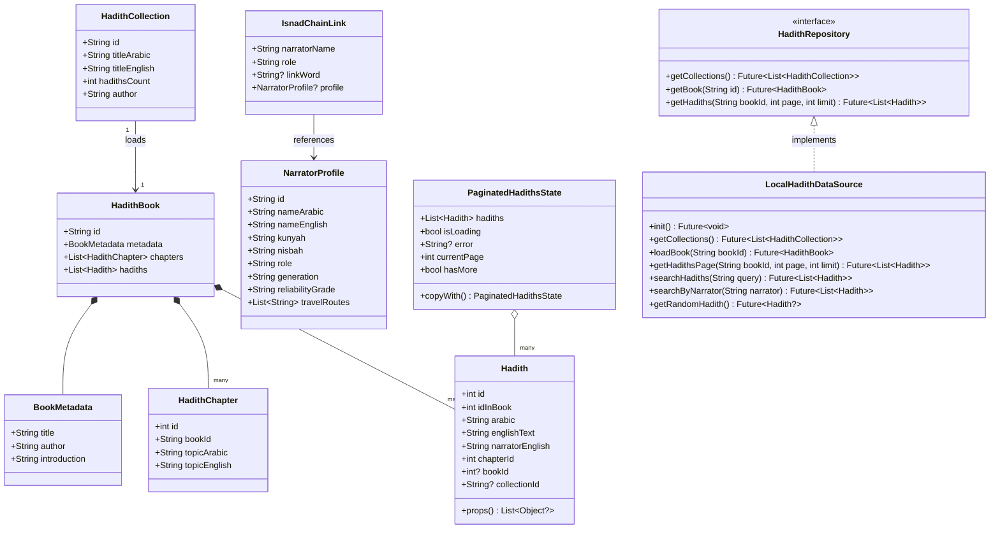
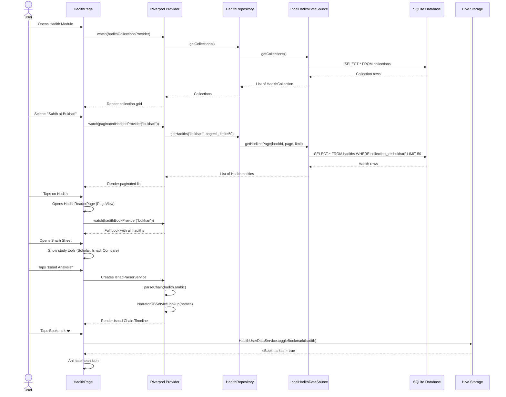
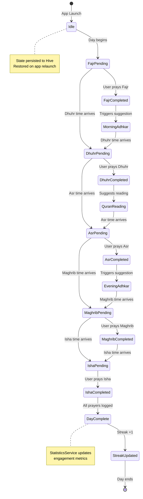
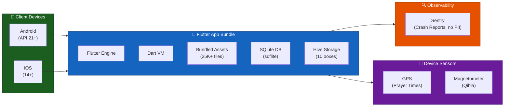

# Architecture & modelling

The diagrams that used to live in the README. They are kept here so the README
stays skimmable without losing the modelling detail.

Noor follows **Clean Architecture** in three layers, enforced by directory
structure:

```
┌─────────────────────────────────────────────────────────┐
│                    Presentation Layer                     │
│   Pages • Widgets • Providers (Riverpod StateNotifiers)  │
├─────────────────────────────────────────────────────────┤
│                      Domain Layer                        │
│          Entities • Repositories (Abstract)              │
├─────────────────────────────────────────────────────────┤
│                       Data Layer                         │
│   DataSources (SQLite/Hive/JSON) • Repository Impls      │
├─────────────────────────────────────────────────────────┤
│                     Core Services                        │
│  Engines • Algorithms • Theme • Router • Shared Utils    │
└─────────────────────────────────────────────────────────┘
```

---

## 1. Component Diagram — System Overview

```mermaid
graph TB
    subgraph Presentation["🖥️ Presentation Layer"]
        HP["HomePage"]
        QP["QuranPage"]
        HDP["HadithPage"]
        PP["PrayerPage"]
        AP["AdhkarPage"]
        QBP["QiblaPage"]
        SP["SearchPage"]
        PFP["ProfilePage"]
    end

    subgraph StateManagement["⚙️ State Management - Riverpod"]
        RP_Q["QuranProviders"]
        RP_H["HadithProviders"]
        RP_P["PrayerProviders"]
        RP_S["SearchProviders"]
    end

    subgraph Domain["📐 Domain Layer"]
        E_H["Hadith Entity"]
        E_Q["Quran Entity"]
        E_P["Prayer Entity"]
        R_H["HadithRepository"]
        R_Q["QuranRepository"]
    end

    subgraph Data["💾 Data Layer"]
        SQLite["SQLite DB\n(sqflite)"]
        Hive["Hive Boxes\n(10 stores)"]
        JSON["Bundled JSON\n(25K+ assets)"]
    end

    subgraph Services["🔧 Core Services"]
        PTE["PrayerTimeEngine"]
        QE["QiblaEngine"]
        ISP["IsnadParserService"]
        NDS["NarratorDBService"]
        HSE["HadithSearchEngine"]
        SNE["SmartNotificationEngine"]
        DSM["DayStateMachine"]
        QAE["QuranAudioEngine"]
        STS["StatisticsService"]
    end

    HP --> RP_Q & RP_H & RP_P
    QP --> RP_Q
    HDP --> RP_H
    PP --> RP_P
    SP --> RP_S

    RP_Q --> R_Q
    RP_H --> R_H
    RP_S --> HSE

    R_H --> SQLite & Hive
    R_Q --> JSON & Hive

    PTE --> Hive
    DSM --> Hive
    STS --> Hive
    ISP --> NDS
    NDS --> JSON

    SNE --> PTE
    QAE --> JSON

    style Presentation fill:#1a5e3a,stroke:#0d3320,color:#fff
    style StateManagement fill:#b8860b,stroke:#8b6508,color:#fff
    style Domain fill:#4a148c,stroke:#311b92,color:#fff
    style Data fill:#0d47a1,stroke:#0a3470,color:#fff
    style Services fill:#bf360c,stroke:#8c2809,color:#fff
```



## 2. Class Diagram — Hadith Domain Model



## 3. Entity-Relationship Diagram — Data Layer

```mermaid
erDiagram
    COLLECTIONS {
        string id PK
        string title_arabic
        string title_english
        string author_arabic
        int hadith_count
        string introduction
    }

    CHAPTERS {
        int id PK
        string collection_id FK
        string title_arabic
        string title_english
        int sort_order
    }

    HADITHS {
        int id PK
        int id_in_book
        string collection_id FK
        int chapter_id FK
        text arabic
        text english_text
        string english_narrator
    }

    NARRATORS {
        string id PK
        string name_arabic
        string name_english
        string kunyah
        string nisbah
        string role
        int generation_level
        string reliability_grade
        string verdict_source
    }

    NARRATOR_RELATIONSHIPS {
        string id PK
        string from_narrator_id FK
        string to_narrator_id FK
        string relationship_type
        string link_word
    }

    HIVE_BOOKMARKS {
        string key PK
        int hadith_id
        string collection_id
        text arabic
        int timestamp
    }

    HIVE_PROGRESS {
        string key PK
        string book_id
        int hadith_index
        int total_hadiths
        int timestamp
    }

    HIVE_STATISTICS {
        string key PK
        int streak_count
        int total_read
        int quiz_score
        string last_active
    }

    COLLECTIONS ||--o{ CHAPTERS : contains
    CHAPTERS ||--o{ HADITHS : contains
    COLLECTIONS ||--o{ HADITHS : belongs_to
    NARRATORS ||--o{ NARRATOR_RELATIONSHIPS : from
    NARRATORS ||--o{ NARRATOR_RELATIONSHIPS : to
    HADITHS ||--o{ HIVE_BOOKMARKS : bookmarked_as
```

## 4. Sequence Diagram — Hadith Reader Flow



## 5. State Diagram — Day State Machine



## 6. Deployment Diagram — Multi-Platform Architecture



---

See also: [accessibility.md](accessibility.md), [testing-guidelines.md](testing-guidelines.md),
[performance.md](performance.md), [coverage-exclusions.md](coverage-exclusions.md).
